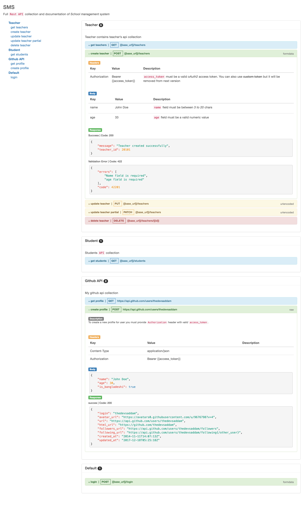

Docgen
=====================

Transform your postman collection to html documentation



### Installation
```go
go get -u github.com/thedevsaddam/docgen
```

#### Mac
```bash
brew tap thedevsaddam/cli https://github.com/thedevsaddam/homebrew-cli.git
brew install docgen
```

#### Linux/Windows
[Download binary](https://github.com/thedevsaddam/docgen-bin)

### Available features
* Live postman collection to documentation
* Build postman collection to html/markdown documentation
* Supports multi-level collection build

### Usage
* To see live documentation from postman collection use `docgen server -f input-postman-collection.json -p 8000` This will open the html version of postman collection to the defined port
* To build a HTML documentation use `docgen build -i input-postman-collection.json -o ~/Downloads/index.html`
* To build a Markdown documentation use `docgen build -i input-postman-collection.json -o ~/Downloads/index.md -m`

***See [example API markdown documentation](example-doc.md)***

### Author
1. [Sajib Sikder](https://github.com/mhshajib)
1. [Saddam H](https://github.com/thedevsaddam)

### Contributor
1. [Anondo](https://github.com/Anondo)

### Contribution
Your suggestions will be more than appreciated.
[Read the contribution guide here](CONTRIBUTING.md)

### See all [contributors](https://github.com/thedevsaddam/docgen/graphs/contributors)

### **License**
The **docgen** is an open-source software licensed under the [MIT License](LICENSE.md).
